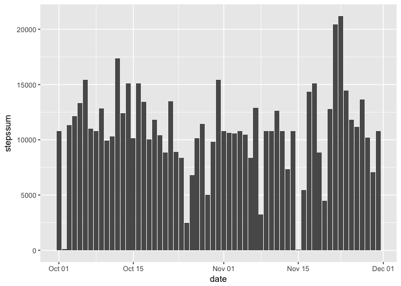

# Reproducible Research: Peer Assessment 1

## Loading required libraries


```r
    require(dplyr)
```

```
## Loading required package: dplyr
```

```
## Warning: package 'dplyr' was built under R version 3.4.2
```

```
## 
## Attaching package: 'dplyr'
```

```
## The following objects are masked from 'package:stats':
## 
##     filter, lag
```

```
## The following objects are masked from 'package:base':
## 
##     intersect, setdiff, setequal, union
```

```r
    require(ggplot2)
```

```
## Loading required package: ggplot2
```

## Loading and preprocessing the data

Reading the csv file
    

```r
    rawData <- read.csv(file = "activity.csv", header = TRUE, 
                        colClasses = c("integer", "Date", "integer"))
```

```
## Warning in strptime(xx, f <- "%Y-%m-%d", tz = "GMT"): unknown timezone
## 'zone/tz/2017c.1.0/zoneinfo/America/Mexico_City'
```

Ignore missing values for the first part


```r
    activityData <- rawData[complete.cases(rawData), ]
```


## What is mean total number of steps taken per day?

Histogram of the total number of steps taken each day

```r
    stepsData <- group_by(activityData, date) %>% summarise(stepssum = sum(steps))
    ggplot(stepsData, aes(date, stepssum)) + geom_bar(stat = "identity")
```

<!-- -->

Mean and median total number of steps taken per day


```r
    stepsMean
```

```
## [1] 10766.19
```

```r
    stepsMedian
```

```
## [1] 10765
```

## What is the average daily activity pattern?

Time series plot of the 5-minute interval and the average number of steps taken, averaged across all days

```r
    intervalData <- group_by(activityData, interval) %>% summarise(stepsmean = mean(steps))
    ggplot(intervalData, aes(interval, stepsmean)) + geom_line()
```

<!-- -->

Which 5-minute interval, on average across all the days in the dataset, contains the maximum number of steps?

```r
    as.numeric(intervalData[which.max(intervalData$stepsmean), 1])
```

```
## [1] 835
```

## Imputing missing values


Calculate and report the total number of missing values in the dataset

```r
    complete <- complete.cases(rawData)
    length(which(complete))
```

```
## [1] 15264
```

```r
    length(which(!complete))
```

```
## [1] 2304
```

Function for filling in all of the missing values in the dataset, uses the mean for that interval

```r
    fillNas <- function(x) {
        intervalFilter <- 0
        stepsMean <- 0.0
        
        for(row in 1:nrow(x)) {
            if(is.na(x[row, "steps"])) {
                intervalFilter <- as.numeric(x[row, "interval"])
                intervalData <- x[x$interval == intervalFilter, ]
                stepsMean <- mean(intervalData$steps, na.rm = TRUE)
                x[row, "steps"] <-  stepsMean
            }
        }
        x
    }
```

Create a new dataset that is equal to the original dataset but with the missing data filled in

```r
    completedData <- fillNas(rawData)
```

Histogram of the total number of steps taken each day

```r
    stepsDataCompleted <- group_by(completedData, date) %>% summarise(stepssum = sum(steps))
    ggplot(stepsDataCompleted , aes(date, stepssum)) + geom_bar(stat = "identity")
```

<!-- -->

Report the mean and median total number of steps taken per day


```r
    stepsMeanCompleted
```

```
## [1] 10766.19
```

```r
    stepsMedianCompleted
```

```
## [1] 10766.19
```

## Are there differences in activity patterns between weekdays and weekends?

Function for calculating if a date is "weekday" or "weekend"

```r
    weekday <- function(dates) {
        weekend <- c("Sat", "Sun")
        day <- vector(mode = "character")
        for(row in 1:length(dates)) {
            if(weekdays(dates[row], abbreviate = TRUE) %in% weekend)
                day <- c(day, "weekend")
            else
                day <- c(day, "weekday")
        }
        day
    }
```
Create a new factor variable in the dataset with two levels, indicating whether a given date is a weekday or weekend day

```r
    completedData$day <- weekday(completedData$date)
```
Panel plot containing a time series plot of the 5-minute interval and the average number of steps taken, averaged across all weekday days or weekend days

```r
    dayData <- group_by(completedData, interval, day) %>% summarise(stepsmean = mean(steps))
    ggplot(dayData, aes(interval, stepsmean)) + geom_line() + facet_grid(day ~ .)
```

<!-- -->
